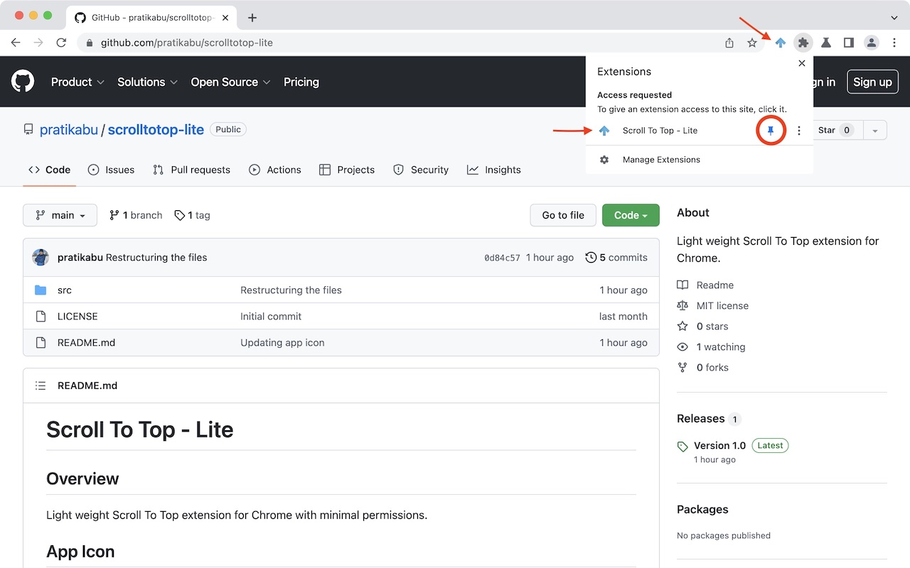
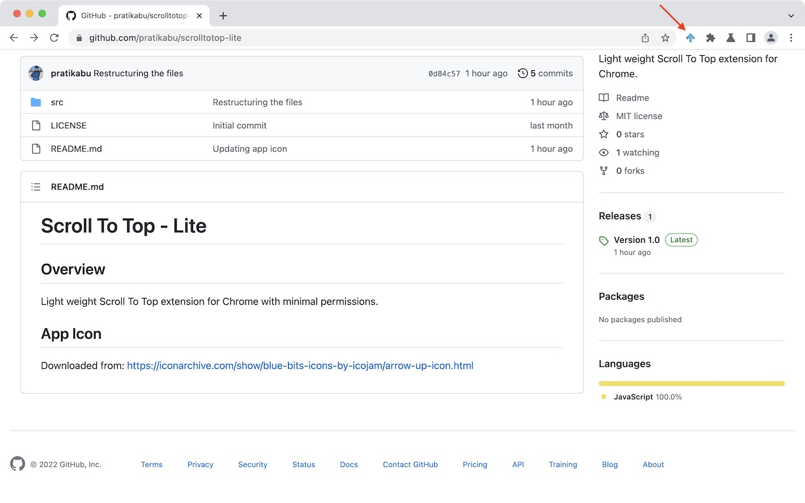

# Scroll To Top - Lite

## Overview
Light weight Scroll To Top extension for Chrome and Firefox with minimal permissions.

## Downloads
Chromium browsers: https://chrome.google.com/webstore/detail/scroll-to-top-lite/jbjcneifeikikbofmopiimefacknnhid
Firefox browser: 

## App Icon
Downloaded from: https://iconarchive.com/show/blue-bits-icons-by-icojam/arrow-up-icon.html

## App Screenshots




## Build for Firefox
Perform below two steps for Firefox.
### Update service_worker
Firefox does not support `service_worker` in the `background` attribute in `manifest.json`.
Replace this line:
```json
"service_worker": "background.js"
```

with this line:
```json
"scripts": ["background.js"]
```

### Add id
Add below lines after the last attribute in `manifest.json`.
```json
,
	"browser_specific_settings": {
		"gecko": {
			"id": "scrolltotop-lite@pratikabu"
		}
	}
```

Now generate the `.zip` file and upload to AMO.
